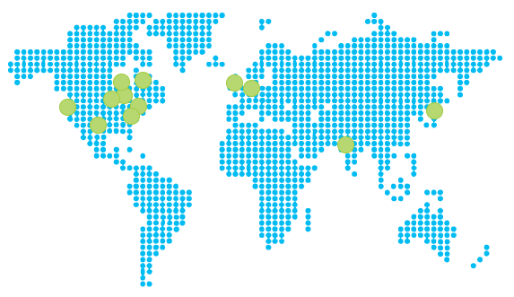
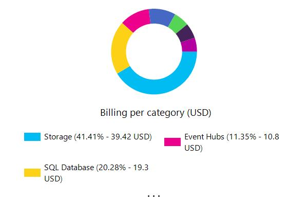
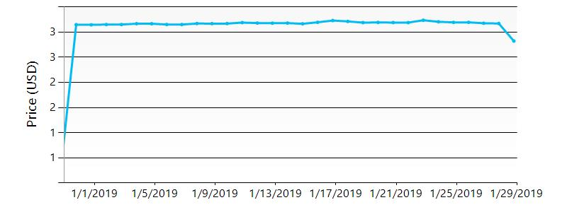
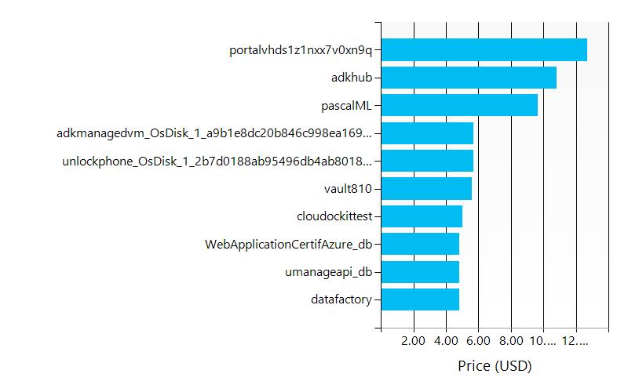

# Executive summary
  
   
This document was generated at the following date : 1/29/2019.  
This document was generated for the subscription(s) :  

- Visual Studio Premium with MSDN - PASCALWANADOO(275ddf79-b240-44e7-9916-f24175b451b1)

  
   
The following Azure data centers are used in your deployment:  
   

| Location | Number of resources |
| --- | --- |
| eastus2  | 52  |
| westus  | 14  |
| eastus  | 189  |
| japaneast  | 7  |
| southcentralus  | 6  |
| centralus  | 21  |
| canadaeast  | 16  |
| centralindia  | 1  |
| northcentralus  | 2  |
| westeurope  | 1  |
| northeurope  | 3  |
| global  | 1  |
| canadacentral  | 1  |
  
The following components are used in your deployment:  
   

| Component | Number |
| --- | --- |
| API Management  | 0  |
| App Service Environments  | 0  |
| App Services  | 19  |
| Application Gateways  | 0  |
| Application Insights  | 0  |
| Automations  | 0  |
| Azure Active Directories  | 0  |
| Azure Cosmos DBs  | 0  |
| Azure Kubernestes  | 0  |
| Azure SQL  | 2  |
| Azure SQL Elastic Pool  | 0  |
| Azure SQL Managed Instance  | 0  |
| Batch  | 0  |
| Cloud Services  | 7  |
| Container Instances  | 0  |
| Container Registries  | 1  |
| Container Services  | 0  |
| Content Delivery Network  | 2  |
| Custom Role Definitions  | 1  |
| Data Lake Stores  | 2  |
| DevTest Labs  | 0  |
| Event Hubs  | 2  |
| ExpressRoute circuit  | 0  |
| Firewall  | 0  |
| IoT Hubs  | 1  |
| Key Vaults  | 3  |
| Logic Apps  | 1  |
| Management Locks  | 0  |
| Media Service  | 0  |
| Network Security Groups  | 19  |
| Notification Hubs  | 1  |
| Policy Assignments  | 1  |
| Policy Definitions  | 162  |
| PostgreSQSL  | 0  |
| Public IPs  | 16  |
| Recovery Service Vault  | 0  |
| Redis  | 0  |
| Remote Apps  | 0  |
| Resource Groups  | 90  |
| Route Tables  | 4  |
| Schedulers  | 1  |
| SearchServices  | 0  |
| Service Bus  | 3  |
| Service Fabric Clusters  | 0  |
| Storage Accounts  | 28  |
| Storage Accounts (Classic)  | 13  |
| Stream Analytics  | 2  |
| Traffic Managers  | 1  |
| Virtual Machines  | 13  |
| Virtual Machines (Classic)  | 3  |
| Virtual Machines Scale Sets  | 0  |
| Virtual Network  | 16  |
| Virtual Network (Classic)  | 0  |
  
   
, your Azure consumption is split across the following categories:  
   
, your Azure consumption has the following trend:  
   
, the components that are the most expensive are the following:  

