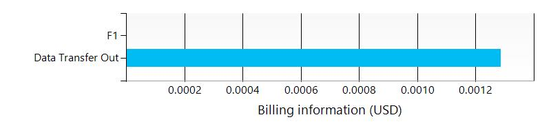

# Default-Web-EastUS /subscriptions/275ddf79-b240-44e7-9916-f24175b451b1/resourceGroups/Default-Web-EastUS
 
##  Resources

| Name | Location | Type |
| --- | --- | --- |
| [CPUHigh Default1](../resources/CPUHigh Default1--1757444802.md)  | eastus  | microsoft.insights/alertrules  |
| [CPUHigh Default2](../resources/CPUHigh Default2--1757379266.md)  | eastus  | microsoft.insights/alertrules  |
| [ForbiddenRequests TestProviderAppBNC](../resources/ForbiddenRequests TestProviderAppBNC--1423660827.md)  | eastus  | microsoft.insights/alertrules  |
| [ForbiddenRequests TestProviderBNC2](../resources/ForbiddenRequests TestProviderBNC2--274647029.md)  | eastus  | microsoft.insights/alertrules  |
| [ForbiddenRequests UManageServiceTest](../resources/ForbiddenRequests UManageServiceTest--1402687955.md)  | eastus  | microsoft.insights/alertrules  |
| [ForbiddenRequests WebApplication58483](../resources/ForbiddenRequests WebApplication58483--866278454.md)  | eastus  | microsoft.insights/alertrules  |
| [ForbiddenRequests WebApplicationWithQueue](../resources/ForbiddenRequests WebApplicationWithQueue--1887367652.md)  | eastus  | microsoft.insights/alertrules  |
| [LongHttpQueue Default1](../resources/LongHttpQueue Default1-706942568.md)  | eastus  | microsoft.insights/alertrules  |
| [LongHttpQueue Default2](../resources/LongHttpQueue Default2--867035544.md)  | eastus  | microsoft.insights/alertrules  |
| [ServerErrors TestProviderAppBNC](../resources/ServerErrors TestProviderAppBNC--617760014.md)  | eastus  | microsoft.insights/alertrules  |
| [ServerErrors TestProviderBNC2](../resources/ServerErrors TestProviderBNC2-229574539.md)  | eastus  | microsoft.insights/alertrules  |
| [ServerErrors UManageServiceTest](../resources/ServerErrors UManageServiceTest-1990300730.md)  | eastus  | microsoft.insights/alertrules  |
| [ServerErrors WebApplication58483](../resources/ServerErrors WebApplication58483--1755009153.md)  | eastus  | microsoft.insights/alertrules  |
| [ServerErrors WebApplicationWithQueue](../resources/ServerErrors WebApplicationWithQueue-1175746575.md)  | eastus  | microsoft.insights/alertrules  |
| [Default1-Default-Web-EastUS](../resources/Default1-Default-Web-EastUS-994911163.md)  | eastus  | microsoft.insights/autoscalesettings  |
| [Default2-Default-Web-EastUS](../resources/Default2-Default-Web-EastUS-1001498804.md)  | eastus  | microsoft.insights/autoscalesettings  |
| [AzureDocKit](../resources/AzureDocKit-506081712.md)  | eastus  | microsoft.insights/components  |
| [MyConsentApp](../resources/MyConsentApp--1420841036.md)  | eastus  | microsoft.insights/components  |
| [pjchost](../resources/pjchost--1529943121.md)  | eastus  | microsoft.insights/components  |
| [pjcpayslipappweb](../resources/pjcpayslipappweb--336947359.md)  | eastus  | microsoft.insights/components  |
| [TestProviderAppBNC](../resources/TestProviderAppBNC-803668274.md)  | eastus  | microsoft.insights/components  |
| [TestProviderBNC2](../resources/TestProviderBNC2--554806867.md)  | eastus  | microsoft.insights/components  |
| [todolistservice-pbon](../resources/todolistservice-pbon--1616128892.md)  | eastus  | microsoft.insights/components  |
| [todolistwebapp-pbon](../resources/todolistwebapp-pbon-657724003.md)  | eastus  | microsoft.insights/components  |
| [umaknow-assesments](../resources/umaknow-assesments--2115844910.md)  | eastus  | microsoft.insights/components  |
| [umanage](../resources/umanage-648381761.md)  | eastus  | microsoft.insights/components  |
| [umanageapi](../resources/umanageapi-1122851901.md)  | eastus  | microsoft.insights/components  |
| [UManageServiceTest](../resources/UManageServiceTest-419730544.md)  | southcentralus  | microsoft.insights/components  |
| [WebApplication58483](../resources/WebApplication58483-695125456.md)  | southcentralus  | microsoft.insights/components  |
| [WebApplicationWithQueue](../resources/WebApplicationWithQueue-318278464.md)  | southcentralus  | microsoft.insights/components  |
| [umanageservice](../resources/umanageservice--1925004521.md)  | eastus  | Microsoft.Sql/servers  |
| [umanageservice/master](../resources/umanageservice/master--372962603.md)  | eastus  | Microsoft.Sql/servers/databases  |
| [60819F752A6065FDF0738F0B908A28A174982F23##East US#](../resources/60819F752A6065FDF0738F0B908A28A174982F23##East US#--995196882.md)  | eastus  | Microsoft.Web/certificates  |
| [B40454952B786C921B92CE75CA4A496E25D91F09](../resources/B40454952B786C921B92CE75CA4A496E25D91F09--548738643.md)  | eastus  | Microsoft.Web/certificates  |
| [Default1](../resources/Default1--1743024446.md)  | eastus  | Microsoft.Web/serverFarms  |
| [Default2](../resources/Default2--1743221054.md)  | eastus  | Microsoft.Web/serverFarms  |
| [adk-web](../resources/adk-web--1703120530.md)  | eastus  | Microsoft.Web/sites  |
| [HubWebapi20161017050201](../resources/HubWebapi20161017050201-953310707.md)  | eastus  | Microsoft.Web/sites  |
| [MyConsentApp](../resources/MyConsentApp-419765987.md)  | eastus  | Microsoft.Web/sites  |
| [sharepointhostedproviderpascal](../resources/sharepointhostedproviderpascal--982201998.md)  | eastus  | Microsoft.Web/sites  |
| [TestProviderAppBNC](../resources/TestProviderAppBNC--285185175.md)  | eastus  | Microsoft.Web/sites  |
| [TestProviderBNC2](../resources/TestProviderBNC2--715546471.md)  | eastus  | Microsoft.Web/sites  |
| [umaknow-assesments](../resources/umaknow-assesments--967831163.md)  | eastus  | Microsoft.Web/sites  |
| [umanage](../resources/umanage-1511448779.md)  | eastus  | Microsoft.Web/sites  |
| [umanageapi](../resources/umanageapi--795059214.md)  | eastus  | Microsoft.Web/sites  |
| [WCFTestservicepascal](../resources/WCFTestservicepascal-27040401.md)  | eastus  | Microsoft.Web/sites  |
| [WebApplicationCertifAzure](../resources/WebApplicationCertifAzure--1648283207.md)  | eastus  | Microsoft.Web/sites  |

##  Billing
 Total cost : 
