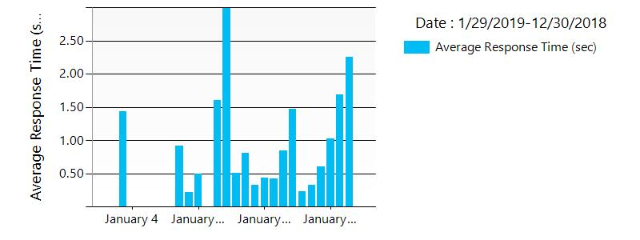
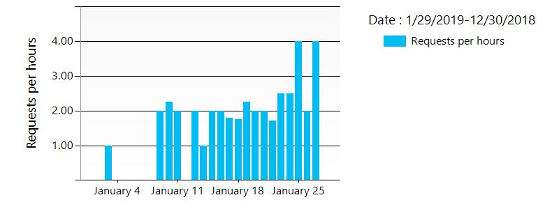
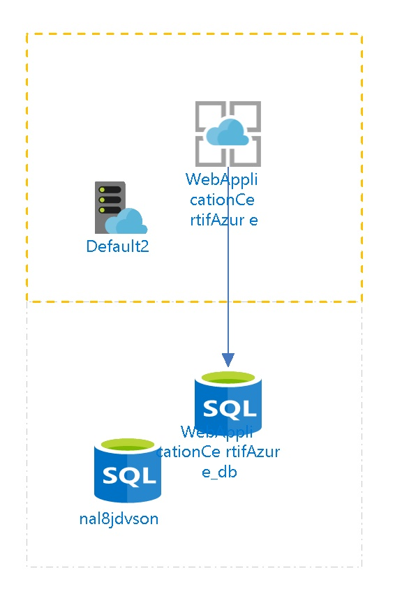
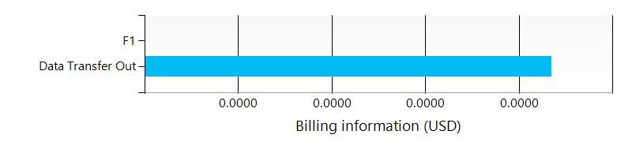

# WebApplicationCertifAzure /subscriptions/275ddf79-b240-44e7-9916-f24175b451b1/resourceGroups/Default-Web-EastUS/providers/Microsoft.Web/sites/WebApplicationCertifAzure
  
##  Settings

| Web Site State | Stopped  |
| --- | --- |
| Always On | False  |
| Load Balancing | LeastRequests  |
| Nb of workers | 1  |
| Auto Swap Slot Name |   |
| Enabled | True  |
| GatewaySiteName |   |
| Location | East US  |
| Outbound Ip Addresses | 23.96.33.205,23.96.34.196,23.96.35.20,23.96.36.229  |
| Premium App Deployed |   |
| Virtual Network Name |   |
| Repository Site Name | WebApplicationCertifAzure  |
| Scm Site Stopped | False  |
| Use 32 Bits Worker Process | True  |

## App Service Plan
 

| Service Plan Name |   |
| --- | --- |
| Application Service Environment |   |
| Geographical Location | East US  |
| Maximum Number Of Workers | 1  |
| Number of Sites | 8  |
| Per Site Scaling enabled | False  |
| Status | Ready  |
| Sku Name | F1  |
| Sku Tier | Free  |
| Sku Family | F  |
| Sku Capacity | 0  |
| Sku Size | F1  |

##  Site diagnostics
The site diagnostics options have been configured as follows.

| Request Tracing Enabled | False  |
| --- | --- |
| Detailed logging enabled | False  |
| Remote Debugging Enabled | False  |
| Remote Debugging Version |   |

##  Functions
The following Functions are deployed in the App Service.
The following Proxies are deployed in the App Service.

##  Default documents
The following default documents are defined.
- Default.htm

- Default.html

- Default.asp

- index.htm

- index.html

- iisstart.htm

- default.aspx

- index.php

- hostingstart.html

## ![](data:image/png;base64,iVBORw0KGgoAAAANSUhEUgAAABIAAAASCAYAAABWzo5XAAAAAXNSR0IArs4c6QAAAARnQU1BAACxjwv8YQUAAAAJcEhZcwAADsMAAA7DAcdvqGQAAALASURBVDhPrVNLTxNRFJ7SF3SYgdoibemLdoZKS6wGZaHGqsF/gEEbEh9ra6NxYeKDhY/ExM5MZ9qiBuIrMVHRjcpGHv4SMWGhUhowkiAmpp5vaG0pujGe5Gbuveecb77znXOZRovsG+fYbvWs2Su/M3VJX4weaQ1fnFuC2RT8ldC/m70nP2zskhYZV6ZscGd+Wnzye+zN9MUZe/jtona8krLVeFG73OSW1nlBe0mJJUckf9i5464byTa/5HZEtEO453tyr5rcmXU+krtSSa0ZmADE5JWW6I+fHL35EdzXA+G8LVo4ZvRKCyavXCSwH/TzGjPUDLpcWLtIjhT2pMlXs1d63RxQVABZvVLG4leekW+JNFsBe4q/QOeiMPCE14HYsJaixI+JxJzJ7FPeUGlJ4cBEBx9Wh1v88h0dyK/IzUHlZHD3eAAs6DyVGJ0zUd48G1LP6UBU97Q1qNyirYEcy9HEA5fuIGssDdZ35GknGJfLZQMB3rD4lBndQbosckL2jDAwEaWAVSRXV0dsLA6gdlGN199T3Lfw/ocxTsydgl46EIm2huB/XQYX5cPAyBZQTrt2jUVJvFXGSWVUli2o6ozMXZl4/T0Ydcbvx2whtcaIJnaaJvYmw5RJI3kFGugOMpQBoHqNdh59vP23RoHsdWrQhkZQnVjNowvVroX35H2soI5Yq13zybdbu7NDnr2PHCx10+pTpkY3uvaBDWlpHQhzgHnAXLQK6iWjJ7NMzErUzUmrP6sAiJ6KRue3YEKxnzlBS3OCeh55/YPP23QgGN4OJlWfbI+0gAnGfWNpjmghCSDEUfz39kghiftNRm/oKpycqL2gKS45+/KJeiBnb+4gMSvxYm4ScSTBtUrqVrOLuROgi2T99fuV2Upps3Wvv/hHJo3WP3ivjQ0paXQDrcWc4EvdnYGwmzT5/8YwvwDE6EByn5W9YQAAAABJRU5ErkJggg==) Host Names
The following Host Names are defined.
- webapplicationcertifazure.azurewebsites.net

- webapplicationcertifazure.scm.azurewebsites.net

##  Metrics

## Average Response Time
 
## Requests
 
## Architecture diagram
 
##  Tags

| Tag Key | Tag Value |
| --- | --- |
| hidden-related:/subscriptions/275ddf79-b240-44e7-9916-f24175b451b1/resourceGroups/Default-Web-EastUS/providers/Microsoft.Web/serverfarms/Default2  | Resource  |

##  Billing
 Total cost : 
