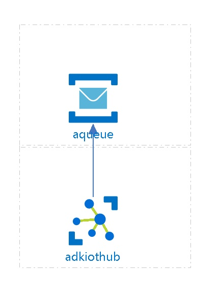

# adkiothub/subscriptions/275ddf79-b240-44e7-9916-f24175b451b1/resourceGroups/adkiot/providers/Microsoft.Devices/IotHubs/adkiothub
 
##  Settings

| Name | adkiothub  |
| --- | --- |
| Location | canadaeast  |
| Sku | <passthrough><ul><li>Name : F1</li><li>Capacity : 1</li><li>Tier : Free</li></ul></passthrough> |
| Cloud To Device Properties | <passthrough><ul><li>Max Delivery Count: 10</li><li>Period of Time Message is available: 01:00:00</li></ul></passthrough>  |

##  Routing

| Fall Back Route Enabled | True  |
| --- | --- |
| Fall Back Route Condition | true  |
| Fall Back Routes | 
<passthrough><ul><li>events&#xa0;</li></ul></passthrough>

## Routes

| Name | Source | Is Enabled | EndPoints |
| --- | --- | --- | --- |
| theoute  | DeviceMessages  | True  | 
<passthrough><ul><li>sbsample1&#xa0;</li></ul></passthrough>

## Service Bus Queue EndPoints

| Name | Resource Group | Connection String |
| --- | --- | --- |
| sbsample1  | adkiot  | Hidden  |

## Service Bus Topics EndPoints

| Name | Resource Group | Connection String |
| --- | --- | --- |

##  IP Filters

| Name | Ip Mask | Action |
| --- | --- | --- |
| thefilter  | 10.10.10.10/5  | Accept  |

##  Built-in endpoints

## Message Bus EndPoints

| Name | Max Delivery Count | Period ot Time Message is available | Lock Duration |
| --- | --- | --- | --- |
| fileNotifications  | 10  | 01:00:00  | 00:01:00  |

## Storage EndPoints

| Name | Connection String | Container Name | Period of Time the SAS URI is valid |
| --- | --- | --- | --- |
| $default  | Hidden  | iothubcontainer  | 01:00:00  |

##  Billing
 Total cost : 
