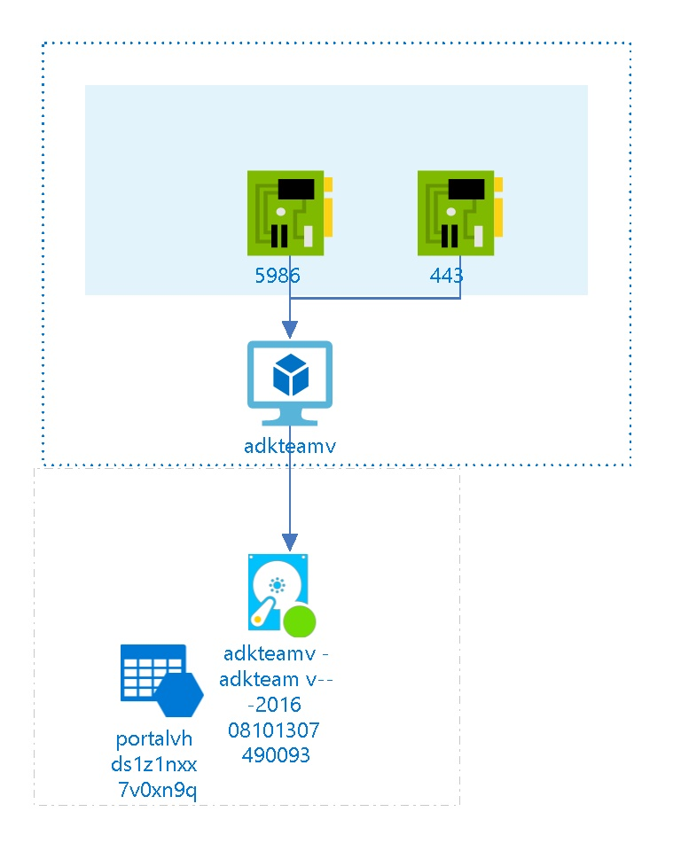

# adkteamv/subscriptions/275ddf79-b240-44e7-9916-f24175b451b1/resourceGroups/adkteamv/providers/Microsoft.ClassicCompute/virtualMachines/adkteamv
 
##  Settings
The virtual machine adkteamv has the following settings:

| Name | adkteamv  |
| --- | --- |
| Uri | http://adkteamv.cloudapp.net/  |
| Operating System | Windows  |
| Size |   |
| Availability Set |   |
| Virtual Network Name |   |
| Virtual IP Address |   |
| IP Address |   |
| State | 3  |
| Instance Status | StoppedDeallocated  |
| Created Date | 8/10/2016 9:07:46 AM  |
| Modified Date | 8/3/2017 4:41:28 PM  |
| Last Patch Date |   |

 
## EndPoints
The following EndPoints are defined :

| Name | Port | Local Port | Load Balancer | Protocol |
| --- | --- | --- | --- | --- |
| PowerShell  | 5986  | 5986  |   | tcp  |
| Remote Desktop  | 443  | 3389  |   | tcp  |
  
##  Virtual Disks
The Virtual Machine is using the following disks

## OS Hard Disks

| Name | Size (GB) | Source Image Name | Host Caching |
| --- | --- | --- | --- |
| adkteamv-adkteamv-0-201608101307490093  |   | a699494373c04fc0bc8f2bb1389d6106__Windows-Server-2012-R2-20160721-en.us-127GB.vhd  | ReadWrite  |

##  Billing
 Total cost : 
