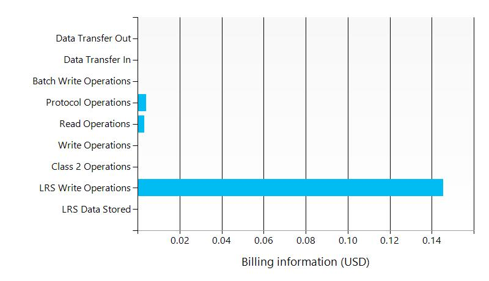

# function3fa45243994d/subscriptions/275ddf79-b240-44e7-9916-f24175b451b1/resourceGroups/screenshotwebtesttodelete/providers/Microsoft.Storage/storageAccounts/function3fa45243994d

##  Settings
The storage function3fa45243994d has the following settings:

| Resource group | screenshotwebtesttodelete  |
| --- | --- |
| Status | available  |
| Location | eastus  |
| Account kind | Storage  |
| Created date | 2016-12-15 21:56:33.00 PM  |
| SKU | StandardLRS  |
| Provisioning state | Succeeded  |
| Blob EndPoint | https://function3fa45243994d.blob.core.windows.net/  |
| File EndPoint | https://function3fa45243994d.file.core.windows.net/  |
| Queue EndPoint | https://function3fa45243994d.queue.core.windows.net/  |
| Table EndPoint | https://function3fa45243994d.table.core.windows.net/  |
| Geo Primary Region | eastus  |
| Geo Secondary Region |   |

##  Blob Storage
The following Blob Storage containers are defined in this storage. 

##  Shared access signature

|   |   |   |   |
| --- | --- | --- | --- |
|   |   |   |   |

##  Billing
 Total cost : 
