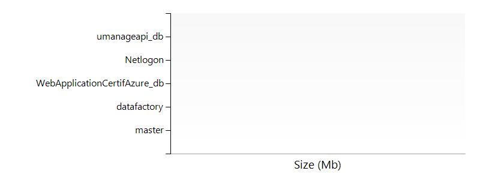
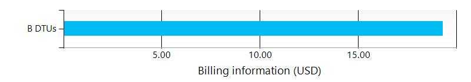

# nal8jdvson/subscriptions/275ddf79-b240-44e7-9916-f24175b451b1/resourceGroups/Default-SQL-EastUS/providers/Microsoft.Sql/servers/nal8jdvson
The SQL Server nal8jdvson  contains the following SQL Databases. 
## ![](data:image/png;base64,iVBORw0KGgoAAAANSUhEUgAAABIAAAASCAYAAABWzo5XAAAAAXNSR0IArs4c6QAAAARnQU1BAACxjwv8YQUAAAAJcEhZcwAADsMAAA7DAcdvqGQAAALnSURBVDhPjZNbSBRRHMZHja6UghARQawP6pZhCoY+1JtF9BJGPvkaREVmqV0sr+hqGGGRta3OZdceXLqYhZYrJK2u19V0vdtipLi26qjpps64+3Vm3PUWmh988D8z5/tx/v8zQ3nkcrl2ER9xOp3Foij+ABGpF4mM5PkV4v3kkZd7+78iG/YIwsIX669SV91AHCo7I1FpCcOnznDZFZZwVPdEo3HwBiYd33lBEC67o2s1NbvQb5uuWQ5KkI8doXjfHiJbqj3vqrujsegUXIa+qQB3fEWHs8wQnYuwTRtRWKdEusEL6VVrnWnwxlfrfcyLY2gbnoUis/mYO75KN03YlliPS3orPnTy6B+bw+hvAeOzgnPCIWJkegEW2yy0LXac03QjUNWKQxuBVtvrlgnbk+qx724DH/KwDcq8Vjm82lsCebwz0cSvB3i8KUhqz/deI3Yk18trvzv1k6H53+RgcG4rwh4t1f8FlVnGoSNzSCofxMmnFvSNOsQumwPZhiGcftEF6/jc1kA/+XnEcr1yPWD/g6N5Lbx0Cp4M/DzdKw99SyA/0lbb0AzoxlFyawtQZDTxofltsM8IiGFWQMpcM07l1ETo9XofjuP83RQiN6i8cwKv28eR8XkIcSX96Lc7RPPwDJ7V2nBG3YU5wYmKHh7JdBUYhrHTDPOWYTmXm0LkOVFKIw6kNcObXL+0PpjaNCl9fPHvrPKwowra8aSkDGrmFYoYroFlWRUBOQi0tIjjopZB6y1dvwSILOhAEGkpWGVGmvoNVBr98ow0GjqawBZfMszxTUGe4UqWYAmF5bj9vGwZROt0EcU0O6lWq30JqE63FZCSnKiQLkERq8NjDZeioekYmmVHWE6LYpaNlcAUlWBKpRKM0wTg2ggUqDI7Fdmt5jxNKUfCIs2wE6QtYQmwWhfhQ101+FPxxrPUdeOD3UkNqQFZzTmKjOZr0t8elFS7V9qm1WoVZNAnpHYYrfaCnKUo6i/tVrNf1UWtYgAAAABJRU5ErkJggg==) Settings
The following settings are defined for the server nal8jdvson 

| Resource group | Default-SQL-EastUS  |
| --- | --- |
| State | Ready  |
| Location | eastus  |
| Server admin |   |
| Active Directory admin | adktestuser1@pascalbonheurwanadoo.onmicrosoft.com  |
| Server name | nal8jdvson.database.windows.net  |
| Version | 12.0  |

##  SQL databases

## Database master/subscriptions/275ddf79-b240-44e7-9916-f24175b451b1/resourceGroups/Default-SQL-EastUS/providers/Microsoft.Sql/servers/nal8jdvson/databases/master

### Settings
The database is using the following settings:

| Pricing Tier | System System0: 0 DTUs  |
| --- | --- |
| Status | Online  |
| Edition |   |
| Creation Date | 9/10/2016 6:35:50 AM  |
| Collation Name | SQL_Latin1_General_CP1_CI_AS  |
| Internal ID | /subscriptions/275ddf79-b240-44e7-9916-f24175b451b1/resourceGroups/Default-SQL-EastUS/providers/Microsoft.Sql/servers/nal8jdvson/databases/master  |
| Used space | 12.0 MB  |
| Max size | 30.0 GB  |

 
### Tables
The database contains the following tables:

### Procedures
The following procedures have been found in the database

### Views
The database contains the following views:

### Users
The database contains the following users:

| User Name | Default Schema Name |
| --- | --- |

### Roles

### Backup Configuration Policies
Backup retention policies for database: master

| PITR Backups |   |
| --- | --- |
| Weekly LTR Backups |   |
| Monthly LTR Backups |   |
| Yearly LTR Backups |   |

### Billing
 Total cost :  ## Database datafactory/subscriptions/275ddf79-b240-44e7-9916-f24175b451b1/resourceGroups/Default-SQL-EastUS/providers/Microsoft.Sql/servers/nal8jdvson/databases/datafactory

### Settings
The database is using the following settings:

| Pricing Tier | Basic Basic: 5 DTUs  |
| --- | --- |
| Status | Online  |
| Edition |   |
| Creation Date | 10/26/2015 7:55:14 PM  |
| Collation Name | SQL_Latin1_General_CP1_CI_AS  |
| Internal ID | /subscriptions/275ddf79-b240-44e7-9916-f24175b451b1/resourceGroups/Default-SQL-EastUS/providers/Microsoft.Sql/servers/nal8jdvson/databases/datafactory  |
| Used space | 4.0 MB  |
| Max size | 2.0 GB  |

 
### Tables
The database contains the following tables:

### Procedures
The following procedures have been found in the database

### Views
The database contains the following views:

### Users
The database contains the following users:

| User Name | Default Schema Name |
| --- | --- |

### Roles

### Backup Configuration Policies
Backup retention policies for database: datafactory

| PITR Backups | 7 days  |
| --- | --- |
| Weekly LTR Backups |   |
| Monthly LTR Backups |   |
| Yearly LTR Backups |   |

### Billing
 Total cost :  ## Database WebApplicationCertifAzure_db/subscriptions/275ddf79-b240-44e7-9916-f24175b451b1/resourceGroups/Default-SQL-EastUS/providers/Microsoft.Sql/servers/nal8jdvson/databases/WebApplicationCertifAzure_db

### Settings
The database is using the following settings:

| Pricing Tier | Basic Basic: 5 DTUs  |
| --- | --- |
| Status | Online  |
| Edition |   |
| Creation Date | 5/4/2015 5:36:44 PM  |
| Collation Name | SQL_Latin1_General_CP1_CI_AS  |
| Internal ID | /subscriptions/275ddf79-b240-44e7-9916-f24175b451b1/resourceGroups/Default-SQL-EastUS/providers/Microsoft.Sql/servers/nal8jdvson/databases/WebApplicationCertifAzure_db  |
| Used space | 4.0 MB  |
| Max size | 1.0 GB  |

 
### Tables
The database contains the following tables:

### Procedures
The following procedures have been found in the database

### Views
The database contains the following views:

### Users
The database contains the following users:

| User Name | Default Schema Name |
| --- | --- |

### Roles

### Backup Configuration Policies
Backup retention policies for database: WebApplicationCertifAzure_db

| PITR Backups | 7 days  |
| --- | --- |
| Weekly LTR Backups |   |
| Monthly LTR Backups |   |
| Yearly LTR Backups |   |

### Billing
 Total cost :  ## Database Netlogon/subscriptions/275ddf79-b240-44e7-9916-f24175b451b1/resourceGroups/Default-SQL-EastUS/providers/Microsoft.Sql/servers/nal8jdvson/databases/Netlogon

### Settings
The database is using the following settings:

| Pricing Tier | Basic Basic: 5 DTUs  |
| --- | --- |
| Status | Online  |
| Edition |   |
| Creation Date | 2/11/2015 3:14:17 PM  |
| Collation Name | SQL_Latin1_General_CP1_CI_AS  |
| Internal ID | /subscriptions/275ddf79-b240-44e7-9916-f24175b451b1/resourceGroups/Default-SQL-EastUS/providers/Microsoft.Sql/servers/nal8jdvson/databases/Netlogon  |
| Used space | 5.0 MB  |
| Max size | 1.0 GB  |

 
### Tables
The database contains the following tables:

### Procedures
The following procedures have been found in the database

### Views
The database contains the following views:

### Users
The database contains the following users:

| User Name | Default Schema Name |
| --- | --- |

### Roles

### Backup Configuration Policies
Backup retention policies for database: Netlogon

| PITR Backups | 7 days  |
| --- | --- |
| Weekly LTR Backups |   |
| Monthly LTR Backups |   |
| Yearly LTR Backups |   |

### Billing
 Total cost :  ## Database umanageapi_db/subscriptions/275ddf79-b240-44e7-9916-f24175b451b1/resourceGroups/Default-SQL-EastUS/providers/Microsoft.Sql/servers/nal8jdvson/databases/umanageapi_db

### Settings
The database is using the following settings:

| Pricing Tier | Basic Basic: 5 DTUs  |
| --- | --- |
| Status | Online  |
| Edition |   |
| Creation Date | 2/13/2015 2:32:53 PM  |
| Collation Name | SQL_Latin1_General_CP1_CI_AS  |
| Internal ID | /subscriptions/275ddf79-b240-44e7-9916-f24175b451b1/resourceGroups/Default-SQL-EastUS/providers/Microsoft.Sql/servers/nal8jdvson/databases/umanageapi_db  |
| Used space | 5.0 MB  |
| Max size | 1.0 GB  |

 
### Tables
The database contains the following tables:

### Procedures
The following procedures have been found in the database

### Views
The database contains the following views:

### Users
The database contains the following users:

| User Name | Default Schema Name |
| --- | --- |

### Roles

### Backup Configuration Policies
Backup retention policies for database: umanageapi_db

| PITR Backups | 7 days  |
| --- | --- |
| Weekly LTR Backups |   |
| Monthly LTR Backups |   |
| Yearly LTR Backups |   |

### Billing
 Total cost :  

##  Firewall Rules
The following rules have been defined

| Rule Name | Start IP | End IP |
| --- | --- | --- |
| ClientIPAddress_2014-10-08_14:10:34  | 24.100.252.58  | 24.100.252.58  |
| ClientIPAddress_2014-10-08_21:23:25  | 184.160.132.111  | 184.160.132.111  |
| ClientIPAddress_2014-10-09_09:14:57  | 207.35.6.213  | 207.35.6.213  |
| ClientIPAddress_2014-10-09_09:50:20  | 24.100.220.68  | 24.100.220.68  |
| ClientIPAddress_2018-5-23_13-9-14  | 184.150.236.43  | 184.150.236.43  |

##  Billing
 Total cost : 
