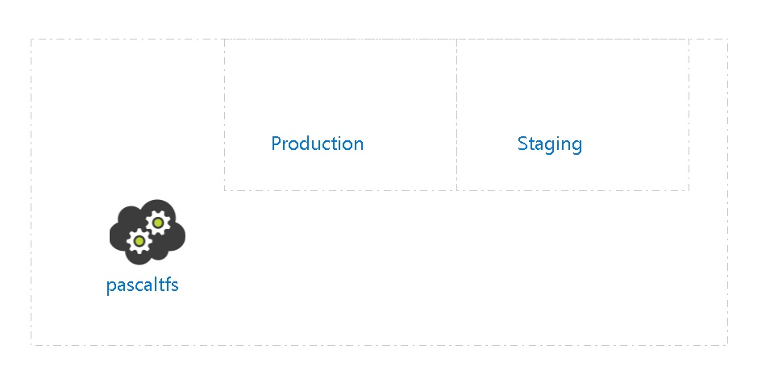

# pascaltfs pascaltfs
 
##  Settings
The Cloud Service pascaltfs has the following settings: 

| Service Name | pascaltfs  |
| --- | --- |
| Uri | https://management.core.windows.net/275ddf79-b240-44e7-9916-f24175b451b1/services/hostedservices/pascaltfs  |
| Affinity Group |   |
| Description |   |
| Label | pascaltfs  |
| Location | Central US  |
| Status | Created  |
| Creation Date | 10/15/2015 1:44:51 PM  |
| Last modification  Date | 10/15/2015 1:45:21 PM  |

##  Production

| Site URL |   |
| --- | --- |
| Public Virtual IP (VIP) Address |   |
| Upgrade Domain Count | 0  |

The following roles are defined in the Production Slot:

##  Staging

| Site URL |   |
| --- | --- |
| Public Virtual IP (VIP) Address |   |
| Upgrade Domain Count | 0  |

The following roles are defined in the Staging Slot:

##  Billing
 Total cost : 
