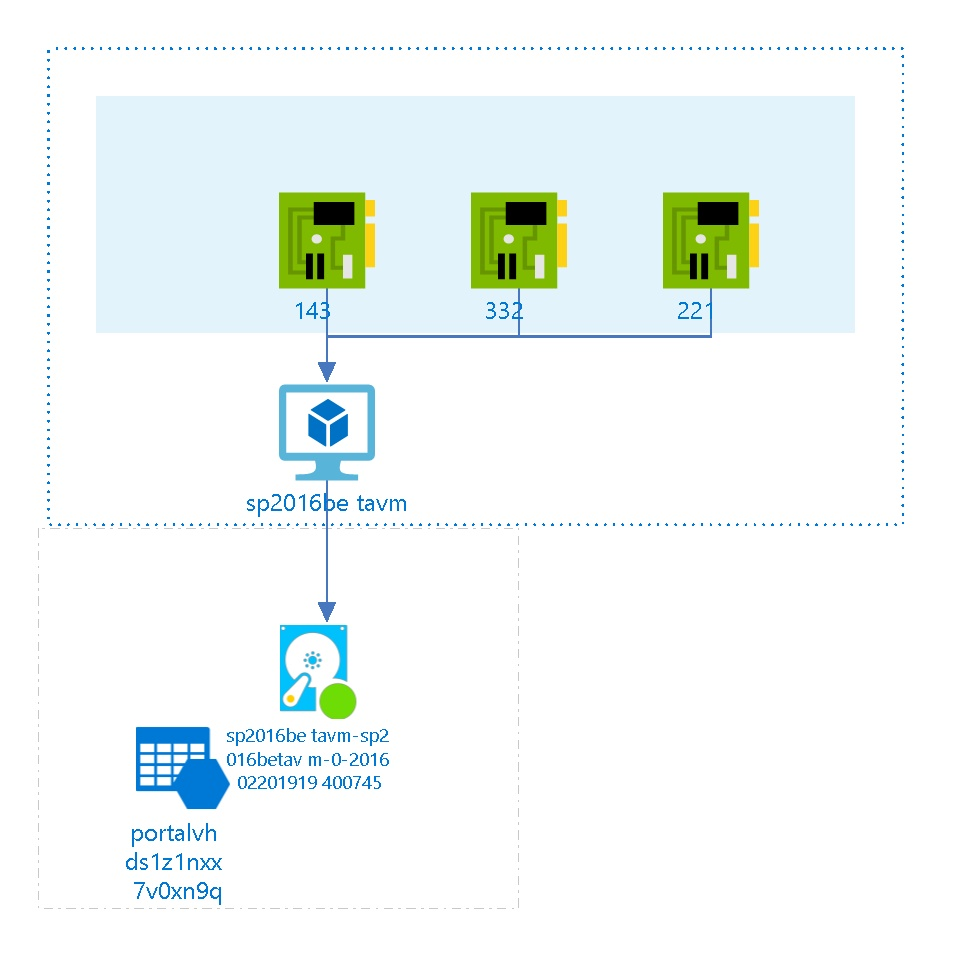

# sp2016betavm/subscriptions/275ddf79-b240-44e7-9916-f24175b451b1/resourceGroups/sp2016betavm/providers/Microsoft.ClassicCompute/virtualMachines/sp2016betavm
 
##  Settings
The virtual machine sp2016betavm has the following settings:

| Name | sp2016betavm  |
| --- | --- |
| Uri | http://sp2016betavm.cloudapp.net/  |
| Operating System | Windows  |
| Size |   |
| Availability Set |   |
| Virtual Network Name |   |
| Virtual IP Address |   |
| IP Address |   |
| State | 3  |
| Instance Status | StoppedDeallocated  |
| Created Date | 2/20/2016 2:19:35 PM  |
| Modified Date | 3/15/2016 10:44:31 PM  |
| Last Patch Date |   |

 
## EndPoints
The following EndPoints are defined :

| Name | Port | Local Port | Load Balancer | Protocol |
| --- | --- | --- | --- | --- |
| IMAP  | 143  | 143  |   | tcp  |
| Remote Desktop  | 332  | 33892  |   | tcp  |
| SSH  | 221  | 221  |   | tcp  |
  
##  Virtual Disks
The Virtual Machine is using the following disks

## OS Hard Disks

| Name | Size (GB) | Source Image Name | Host Caching |
| --- | --- | --- | --- |
| sp2016betavm-sp2016betavm-0-201602201919400745  |   | a699494373c04fc0bc8f2bb1389d6106__Windows-Server-2012-R2-20160126-en.us-127GB.vhd  | ReadWrite  |

##  Billing
 Total cost : 
