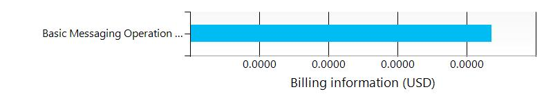

# thesbtestforadk/subscriptions/275ddf79-b240-44e7-9916-f24175b451b1/resourceGroups/adkiot/providers/Microsoft.ServiceBus/namespaces/thesbtestforadk

| / |
| --- |

##  Settings

| Name | thesbtestforadk  |
| --- | --- |
| Resource group | adkiot  |
| Loation | Canada East  |
| Type | Microsoft.ServiceBus/Namespaces  |
| Created | 11/20/2017 8:10:44 PM  |
| Updated | 10/9/2018 1:32:10 PM  |
| Provisioning state | Succeeded  |
| Endpoint | https://thesbtestforadk.servicebus.windows.net:443/  |

##  Queues

## Queue aqueue

### Overview
 

| Name | aqueue  |
| --- | --- |
| Queue URL | https://thesbtestforadk.servicebus.windows.net/aqueue  |
| Creation Date | 11/20/2017 8:12:30 PM  |
| Status | Disabled  |
| Active message count | 0  |
| Scheduled message count | 0  |
| Dead-letter message count | 0  |
| Transfer message count | 0  |
| Transfer dead-letter message count | 0  |
| Max size | 16.0 GB  |
| Current size | 0.0 bytes  |

 
### Settings
 

| Message time to live (default) | 14.00:00:00  |
| --- | --- |
| Lock duration | 00:00:30  |
| Duplicate detection history | 00:10:00  |
| Maximum Delivery Count | 10  |
| Maximum size | 16.0 GB  |
| Queue State | Disabled  |
| Updated at | Thursday, November 23, 2017, 15:04:33.00 PM  |
| Enable Partitioning | True  |

 

## ![](data:image/png;base64,iVBORw0KGgoAAAANSUhEUgAAABQAAAAUCAYAAACNiR0NAAAAAXNSR0IArs4c6QAAAARnQU1BAACxjwv8YQUAAAAJcEhZcwAADsMAAA7DAcdvqGQAAAMTSURBVDhPlZRNTBNBFMcHDBL7YaXt7uwKB9QiH4Vy8OLRSCJ6MeHAwYNGjDHxYDxy8NCLod0tknDEcDDVYADLR4k1SLu7WCQYSrtFjJEYEr0YIxERi5SFrq/bbdmWEuI/+Wczs/N+O7PvvUEHyRkwH3eHiA4XR7xkOWLVt2BPDMzXvn8aOd0WWLaVq8sO18OguZLhyUkPT6W6p2k5Y0qeWGzOeXzRsesT7U/6IrRODSsiGZWw08Qlj0DL+50PzHo01rTunT1jUwn5cgXNbd0Clv4HmPaY2Lg2OGdrUDEZuXlzVTEQw1EbDI8jDE+M+KL28GisccUvOlKF0NF440r/TK1RxSHEcHiqEMZy+I1boOrhdUlmFULtQ+jIQKSuDXa1qQX6482pwfn6B8oiJ48MsJOUFsaEcLg3cHAmveLZU4VQGH/uDaByxApEuxbGCtQfNkg61FhFOp2uFWOsV4eKhhfqOrXAiXiz7J2raUYsR4a1QDh+BNbnjqnX61uMRuNHgD6DYVlmFiHffB09LjZJWuhQpOYmcoXILS2QFfCwGqMIgNcMBsMXANLqlKL+GYvRH3P81gLHRftdxIasq1qgWyDG1JisSgHYCf5kMplOqHMoNVt1LBm3ru3ESTnr5KL5FvJwxMheRwCUo5adMipV4xActwNg3+G5BMOjmVmEEjFzZVIkdrTAv5GKVuTiTOe0O4SW2+2aIi6rcYrg2BdpOr/NJNHMamHbolVaf2e0oDsRVMYK9I4WCjX4y/kWk2rsPiXixvPJKJHSAsGTcvZkkFmPFqhAefzTJRA3uv209RH8L4+I9S7eVO0WcE8PtOhGzJLIwqQ4KUnRiisKLK17UMTQr98KoWkzAoYqoNbgA+ss/I7s/ONpvLEZJaQM1PoCdpcrNUXO15aTLE9+1cIO8/Mw+WMrauVl/wHXmOuVqRp28oHl6bxWLGqe2oaa9S4tNeQyX1SeSaxnOPI+gKMMT+UlK21ImOTicMDD4wvpO1QNO1x9kP0unrB1hcirTNB6G66w6/ChFidvsDqde3WaL4T+AcGRZ73JDP0BAAAAAElFTkSuQmCC) Billing
 Total cost : 
