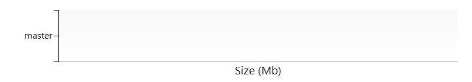

# umanageservice/subscriptions/275ddf79-b240-44e7-9916-f24175b451b1/resourceGroups/Default-Web-EastUS/providers/Microsoft.Sql/servers/umanageservice
The SQL Server umanageservice  contains the following SQL Databases. 
## ![](data:image/png;base64,iVBORw0KGgoAAAANSUhEUgAAABIAAAASCAYAAABWzo5XAAAAAXNSR0IArs4c6QAAAARnQU1BAACxjwv8YQUAAAAJcEhZcwAADsMAAA7DAcdvqGQAAALnSURBVDhPjZNbSBRRHMZHja6UghARQawP6pZhCoY+1JtF9BJGPvkaREVmqV0sr+hqGGGRta3OZdceXLqYhZYrJK2u19V0vdtipLi26qjpps64+3Vm3PUWmh988D8z5/tx/v8zQ3nkcrl2ER9xOp3Foij+ABGpF4mM5PkV4v3kkZd7+78iG/YIwsIX669SV91AHCo7I1FpCcOnznDZFZZwVPdEo3HwBiYd33lBEC67o2s1NbvQb5uuWQ5KkI8doXjfHiJbqj3vqrujsegUXIa+qQB3fEWHs8wQnYuwTRtRWKdEusEL6VVrnWnwxlfrfcyLY2gbnoUis/mYO75KN03YlliPS3orPnTy6B+bw+hvAeOzgnPCIWJkegEW2yy0LXac03QjUNWKQxuBVtvrlgnbk+qx724DH/KwDcq8Vjm82lsCebwz0cSvB3i8KUhqz/deI3Yk18trvzv1k6H53+RgcG4rwh4t1f8FlVnGoSNzSCofxMmnFvSNOsQumwPZhiGcftEF6/jc1kA/+XnEcr1yPWD/g6N5Lbx0Cp4M/DzdKw99SyA/0lbb0AzoxlFyawtQZDTxofltsM8IiGFWQMpcM07l1ETo9XofjuP83RQiN6i8cwKv28eR8XkIcSX96Lc7RPPwDJ7V2nBG3YU5wYmKHh7JdBUYhrHTDPOWYTmXm0LkOVFKIw6kNcObXL+0PpjaNCl9fPHvrPKwowra8aSkDGrmFYoYroFlWRUBOQi0tIjjopZB6y1dvwSILOhAEGkpWGVGmvoNVBr98ow0GjqawBZfMszxTUGe4UqWYAmF5bj9vGwZROt0EcU0O6lWq30JqE63FZCSnKiQLkERq8NjDZeioekYmmVHWE6LYpaNlcAUlWBKpRKM0wTg2ggUqDI7Fdmt5jxNKUfCIs2wE6QtYQmwWhfhQ101+FPxxrPUdeOD3UkNqQFZzTmKjOZr0t8elFS7V9qm1WoVZNAnpHYYrfaCnKUo6i/tVrNf1UWtYgAAAABJRU5ErkJggg==) Settings
The following settings are defined for the server umanageservice 

| Resource group | Default-Web-EastUS  |
| --- | --- |
| State | Ready  |
| Location | eastus  |
| Server admin |   |
| Active Directory admin | pascal@umaknow.com  |
| Server name | umanageservice.database.windows.net  |
| Version | 12.0  |

##  SQL databases

## Database master/subscriptions/275ddf79-b240-44e7-9916-f24175b451b1/resourceGroups/Default-Web-EastUS/providers/Microsoft.Sql/servers/umanageservice/databases/master

### Settings
The database is using the following settings:

| Pricing Tier | System System0: 0 DTUs  |
| --- | --- |
| Status | Online  |
| Edition |   |
| Creation Date | 3/18/2018 3:20:16 PM  |
| Collation Name | SQL_Latin1_General_CP1_CI_AS  |
| Internal ID | /subscriptions/275ddf79-b240-44e7-9916-f24175b451b1/resourceGroups/Default-Web-EastUS/providers/Microsoft.Sql/servers/umanageservice/databases/master  |
| Used space | 7.0 MB  |
| Max size | 30.0 GB  |

 
### Tables
The database contains the following tables:

### Procedures
The following procedures have been found in the database

### Views
The database contains the following views:

### Users
The database contains the following users:

| User Name | Default Schema Name |
| --- | --- |

### Roles

### Backup Configuration Policies
Backup retention policies for database: master

| PITR Backups |   |
| --- | --- |
| Weekly LTR Backups |   |
| Monthly LTR Backups |   |
| Yearly LTR Backups |   |

### Billing
 Total cost :  

##  Firewall Rules
The following rules have been defined

| Rule Name | Start IP | End IP |
| --- | --- | --- |
| ClientIPAddress_2015-00-02_06:00:14  | 173.176.74.147  | 173.176.74.147  |
| ClientIPAddress_2015-10-28_19:21:27  | 216.206.111.130  | 216.206.111.130  |

##  Billing
 Total cost : 
